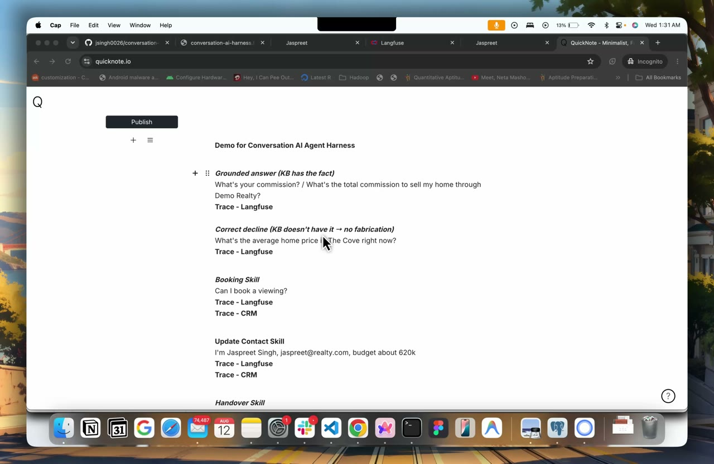
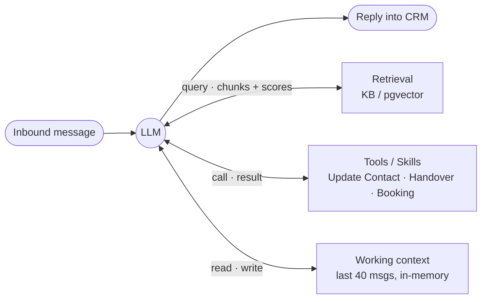

# Conversation AI Agent Harness

An agent harness that powers a [HighLevel](https://www.gohighlevel.com/) Conversation AI agent
end-to-end: it receives an inbound customer message, decides what to do — **answer from a knowledge
base, run a skill, or hand over to a human** — executes it, and replies back into the CRM
conversation, with a **full, inspectable trace** of every step.

Built for a fictional real-estate brokerage, **Demo Realty**. TypeScript · Fastify · Vercel AI SDK.

> **Demo Realty is a fictional business** invented for this take-home — not a real brokerage; its
> neighborhoods, prices, and policies are made up. “HighLevel” is a trademark of its respective owner;
> this project is independent and not affiliated with or endorsed by HighLevel.

---

## 👋 For the reviewer — start here

**It's live.** No setup needed to see it running:

| | URL |
|---|---|
| 🌐 **Demo site (with the live chat widget)** | **https://conversation-ai-harness.fly.dev/** |
| 🟢 Harness (health) | **https://conversation-ai-harness.fly.dev/health** |
| 🔎 Langfuse (self-hosted traces) | **https://conversation-ai-langfuse.fly.dev** |
| 🎥 **Demo video** (~8 min walkthrough) | **https://drive.google.com/file/d/1iwHlTJ9pIdU3AZDy1dQFTBApixjT73lT/view** — knowledge (grounded + decline), contact update + handover in the CRM, execution trace + provider switch |
| 💬 Real end-user path | the widget on the demo site → HighLevel native `InboundMessage` webhook → this harness → reply (see demo video) |

<a href="https://drive.google.com/file/d/1iwHlTJ9pIdU3AZDy1dQFTBApixjT73lT/view">
  
</a>

▶️ **[Watch the ~8-minute demo](https://drive.google.com/file/d/1iwHlTJ9pIdU3AZDy1dQFTBApixjT73lT/view)** — grounded KB answer + correct decline · contact update + human handover (visible in HighLevel) · one execution trace in Langfuse + a live provider switch.

**Langfuse reviewer login** (read-only, to browse the live traces):
`dhairya@demo-realty.review` · password `Dhairya-Review-2026` — **VIEWER** on the `conversation-ai`
project (view Traces / Sessions / Generations; can't edit).

The **demo site** (Demo Realty) is served at `/` by the harness itself and embeds the HighLevel Live
Chat widget in the corner — chat there and the message flows through the full loop below.

Deployed on Fly.io (region `sin`): the harness on one always-warm machine, **Fly Managed Postgres
with `pgvector`** (the KB vector store **and** webhook idempotency), and a **self-hosted Langfuse v2**
for traces. The live `/webhook` accepts either our shared secret (`x-webhook-secret`) **or** a valid
HighLevel webhook signature (`x-ghl-signature`) — exercise the full loop via the **HighLevel Live Chat
widget** (the genuine user path, in the demo video) or **locally against mocks** (next section), which
needs no accounts.

### Evaluate the whole thing in ~10 minutes

```bash
pnpm install
echo "LLM_PROVIDER=claude
ANTHROPIC_API_KEY=sk-ant-...   # or set openai/gemini
EMBED_LOCAL=true               # on-device embeddings, no key
CRM_MODE=mock" > .env

pnpm ingest        # build the KB vector index (on-device embeddings)
pnpm test          # 195 unit tests
pnpm dev           # webhook server on :3000

# In another shell — send a customer message through the full loop (mock CRM):
curl -sX POST localhost:3000/webhook -H 'content-type: application/json' \
  -d '{"messageId":"m1","conversationId":"c1","contactId":"ct1","body":"What is your commission?","messageType":"SMS"}'

pnpm trace latest  # ← the answer to "why did the agent say that?"
pnpm eval          # one-command eval suite (add provider keys)
```

### Where each assignment requirement lives

| Requirement | Implementation | Verify it |
|---|---|---|
| **Multi-provider (Claude/OpenAI/Gemini), config-switchable** | `src/providers/` — one `AiSdkProvider` behind an `LLMProvider` seam | flip `LLM_PROVIDER`; `pnpm providers:smoke`; eval runs per-provider |
| **RAG *triggered selectively*, grounded, never invents** | retrieval is a **tool the agent chooses** (`src/rag/search-kb.tool.ts`); similarity threshold → explicit `grounded:false` → decline | `rag-trigger` + `groundedness` eval suites; a trace shows chunks+scores or *no* retrieval step |
| **Extensible skills = registration** | `src/skills/` — Update Contact, Human Handover, Appointment Booking; add one = one file + one array entry | `src/skills/index.ts`; the three `*.skill.ts` files |
| **Execution transparency (per-turn trace)** | canonical `Trace` → Langfuse + JSON + CLI (`src/trace/`) | `pnpm trace latest`, or the live Langfuse UI |
| **Webhook realities: idempotency + rapid messages** | `IdempotencyStore` (dedupe, w/ Postgres lease) + per-conversation `KeyedQueue` (serialize) | `src/orchestrator/{idempotency,queue}.ts` + tests |
| **Latency p50 ≤ 3s / p95 ≤ 6s** | fast-ack webhook, async processing; measured per-provider, all within target | `latency` eval suite — p50 **0.86s** (gpt-4.1-nano) to **2.06s** (gemini-flash-latest); table below |
| **One-command evals w/ negatives** | `pnpm eval` — 116 gold cases across 5 behaviors + latency, incl. must-NOT-fire negatives | `pnpm eval`; `evals/` |
| **Team-of-One, functional-vs-mocked** | below + [`docs/`](./docs) | this README |

> 📐 [`docs/ARCHITECTURE.md`](./docs/ARCHITECTURE.md) · 🔌 [`docs/SETUP.md`](./docs/SETUP.md) (sandbox +
> Fly deploy) · 📚 [`docs/KNOWLEDGE_BASE.md`](./docs/KNOWLEDGE_BASE.md) (**add your own KB doc**) ·
> 🎬 [`docs/DEMO.md`](./docs/DEMO.md) · 🛡️ [`docs/PRODUCTION_HARDENING.md`](./docs/PRODUCTION_HARDENING.md) ·
> 📄 [`docs/ASSIGNMENT.md`](./docs/ASSIGNMENT.md)

---

## The orchestration loop

One bounded tool-use loop is the single decision mechanism — no brittle intent classifier.

```
Inbound webhook → verify secret / HL signature → normalize → idempotency dedupe → debounce burst
                                                              → per-conversation queue → ack fast
                                                              │
                              ┌────────────────────────────────┘
                              ▼  Orchestrator.runTurn  (bounded tool-use loop)
       bot disabled? ──yes──▶ send a holding reply ("a team member will follow up") — not silence
            │no
            ▼
       fetch contact (what's on file) + system prompt + history (last 40) + user msg ──▶ generate(tools)
            ├─ no tool call   → reply directly (chit-chat)      ← RAG NOT triggered
            ├─ search_kb      → retrieve (threshold) → grounded answer / decline
            ├─ a skill        → execute, feed result back, loop
            └─ handover       → can we reach them (name + email/phone)?
                                  no  → ask for the missing details first (HITL gate)
                                  yes → stop bot, tag/reassign, send final message
            ▼
       send reply into CRM ──▶ emit Trace (Langfuse / JSON / CLI)
```

Why a tool-loop: the model's own tool-choice *is* the routing decision, so "when to retrieve",
"which skill", and "just chat" are one uniform mechanism — and each choice is visible in the trace.

### Architecture pattern — an *Augmented LLM* in a bounded agentic loop

The **Augmented LLM** — one model augmented with **retrieval, tools, and memory** — realized here
(adapted from Anthropic's [*Building Effective Agents*](https://www.anthropic.com/engineering/building-effective-agents)):



> **Source of truth is HighLevel, not this box.** The *Working context* is a bounded, in-memory
> buffer (last 40 messages, per conversation) that assembles the model's context window each turn —
> a cache, not a store. The durable conversation log lives in HighLevel (system of record); every
> reply is written back there. On restart the buffer starts cold and rebuilds from the next turn —
> HighLevel still holds the full thread (a `getConversationHistory` seam exists to rehydrate from it
> if that ever matters; single-tenant demo scope doesn't need it).

Mapped to that article, this harness is the **Augmented LLM** building block (*"an LLM enhanced with
retrieval, tools, and memory"*) run as a **bounded autonomous agent** (*"LLMs using tools based on
environmental feedback in a loop"*). **Routing** — RAG vs. a skill vs. plain chat — isn't a separate classifier; it
**emerges from the model's tool choice** inside that single loop. We deliberately follow the article's
*"simplicity first"* guidance and **avoid** the heavier workflow patterns (orchestrator-workers,
evaluator-optimizer, parallelization) — a single augmented LLM with a RAG tool, skills, and
conversation memory fully covers a CRM conversation agent. Skills are the article's **Agent-Computer
Interface**: each is a Zod-typed, documented tool the model fills but never authors.

**You can see the pattern in Langfuse:** every turn's trace tree *is* the loop —
`GENERATION` (decide) → `retrieval` / `tool:*` span (act on the environment) → `GENERATION` (answer) —
and the turn's `decision` name + `ragUsed` / `sources` / `toolsUsed` make the routing explicit.

---

## The four capabilities

**1. Multi-provider LLM.** One `AiSdkProvider` implements `LLMProvider` for all three vendors over
the Vercel AI SDK — same code, a different model handle. Errors normalize to typed classes
(`RateLimitError`, `AuthError`, `ContextLengthError`, `TransientError`) so retry/backoff is uniform.
An OpenAI-compatible `baseURL` lets the same seam drive gateways (Groq / OpenRouter / llmapi.ai —
prod currently runs `gpt-4.1-nano` via llmapi.ai for reliable, cheap tool-calling). Adding a 4th
native provider = one case in `src/providers/registry.ts`. **Switch = `LLM_PROVIDER` / `OPENAI_*` env.**

**2. RAG, triggered — not always-on.** Retrieval is a tool the agent calls only when it needs facts,
so chit-chat and skill turns never touch the vector store (the assignment's core RAG concern). A
heading-aware chunker → on-device embeddings (`bge-small`, 384-dim) → cosine search. A similarity
**threshold** produces an explicit `grounded:false` signal, so the agent **declines rather than
invents** when the KB has no answer. KB docs carry **OKF (Open Knowledge Format) frontmatter** —
`status` / `verified` / `stale_after` / `source` — so grounding is **provenance-aware**: a match
that's `deprecated` or past `stale_after` is declined with reason `stale` (never quote outdated
policy), and each source's trust + freshness rides along into the trace. 13 KB docs → 94 chunks.
**Adding a doc** = drop a markdown file in `kb/` and re-ingest (`pnpm ingest` / `ingest:pg`; a
`fly deploy` re-ingests automatically) — step-by-step in [`docs/KNOWLEDGE_BASE.md`](./docs/KNOWLEDGE_BASE.md).
See also [`docs/OKF_DESIGN.md`](./docs/OKF_DESIGN.md).

**3. Extensible skills.** Each skill is an `AgentTool` (name + Zod schema + `run`), and the schema is
surfaced to the model and validated on the way in. Adding one is **registration** — a file plus an
entry in `src/skills/index.ts`:
- **Update Contact Field** — extracts name/email/budget/preferred-time the customer shares and writes
  them to the contact (standard vs. custom fields mapped for HighLevel). **Conflict-aware:** if a field
  already holds a *different* value (record says "Alex", customer now says "Sam"), it returns
  `needsConfirmation` with the existing value so the agent confirms before overwriting — never silently.
- **Human Handover** — on explicit ask / frustration / out-of-scope (real-estate matters needing a
  person — *not* off-topic trivia): sends a final message, stops the bot, tags + reassigns the contact.
  Bot-off state is **durable** (rehydrates from the CRM tag). A **HITL gate** won't hand off until we
  have a name + email/phone (asks for what's missing first), and a handed-over conversation gets a
  brief **holding reply** instead of going silent.
- **Appointment Booking** — `get_available_slots` (handles "tomorrow afternoon") → **presents the
  options and waits for a choice** (never auto-books) → `book_appointment`. Requires the customer's
  name + a contact channel first (gate); **never double-books** (returns `needsReschedule`);
  `reschedule=true` cancels-then-rebooks; plus a real **`cancel_appointment`** and a read-only
  **`get_my_appointments`**. Handles no-availability and slot-taken races; idempotent on the same slot.
- **Contact-aware turns** — the orchestrator injects what we already know about the contact (name /
  email / phone on file) into each turn's system prompt, so the agent proactively asks for only the
  missing details before a booking or handover — instead of discovering the gap when a tool refuses.

**4. Execution transparency.** Every turn emits a canonical `Trace`: assembled system prompt,
provider/model, whether RAG fired (which KB docs + `kb/…md` paths + similarity scores), each tool's
inputs/outputs/CRM calls, tokens, per-step latency, and the decision. Fanned out to **self-hosted
Langfuse**, **JSON files**, and a **CLI viewer** (`pnpm trace`). In Langfuse it's production-grade:
turns grouped into **sessions** (per conversation) + **users** (per contact), **cost per turn**,
failures flagged **`level:ERROR`**, traces **named by decision** (chart the routing distribution),
and observations **step-numbered by role** — `1·llm:decide → 2·retrieval → 3·llm:answer`.

**PII masking (highlight).** Emails and phones — *including the Unicode-dash / no-break-space formats
LLMs emit* (`012‑8899`) — plus secret keys and auth headers are masked at the **observability sinks**:
pino `redact.paths` for known keys + a **free-text `logMethod` hook** for anything interpolated into
messages, and the **trace exporter scrubs** input/reply/system/tool-I/O before export. The **LLM
input is left intact** on purpose (the skills need the real name/email/budget). RE2-safe patterns with
a length guard keep it ReDoS-safe on the hot path. See `src/util/redact.ts`.

---

## Latency & Evals (the quality bars)

**Latency** — fast webhook ack + async per-conversation processing. Target **p50 ≤ 3s / p95 ≤ 6s**
webhook-to-send for **non-RAG turns** — i.e. the single-hop turns that don't retrieve or call a
tool: greetings, acknowledgements, thanks, quick chit-chat (one `generate`, straight to a reply).
Measured per-provider it lands **p50 0.86–2.06s / p95 1.28–2.60s** — all within target (see the eval
table). RAG and skill turns add a second model hop (two `generate` calls, plus a retrieval or CRM
round-trip) so they run higher — expected, and the target is scoped to non-RAG turns. Per-turn
`latencyMs` is on every trace.

**Evals — one command, negatives included, per provider:**

```bash
pnpm eval                          # all providers with a key, all suites
pnpm eval openai handover latency  # provider(s) + suite filter
```

Runs real turns and scores each trace against **116 gold-labeled cases** across five behaviors, plus
a latency suite:

| Suite | Cases | Measures |
|---|---|---|
| `rag-trigger` | 26 | precision/recall of *deciding to retrieve* (chit-chat/skill turns must not) |
| `groundedness` | 24 | grounded answers contain expected facts; out-of-KB questions are declined |
| `update-contact` | 22 | extraction fires + correct fields; **negatives don't fire** |
| `handover` | 22 | fires on explicit/frustrated/out-of-scope; **negatives don't fire** |
| `appointment` | 22 | booking intent triggers slot lookup; **negatives don't fire** |
| `latency` | 8 | p50/p95 webhook-to-send on non-RAG turns (greetings/acks — no retrieval or tool) |

Grounded facts are matched with word/number boundaries (so `5%` ≠ `15%`); declines are checked
against a fabricated-figure denylist. Infra errors (e.g. a missing embedding key) are surfaced as
errors — they never masquerade as model behavior.

**Real results** (run 2026-08-11, via llmapi.ai; pass-rate per suite — **precision is 100% on every
skill suite: the agent never mis-fires or fabricates**, so all misses are *recall*):

| Model | rag-trigger | groundedness | update-contact | handover | appointment | latency p50/p95 |
|---|---|---|---|---|---|---|
| **claude-sonnet-5** (llmapi) | 26/26 | 22/24 | 22/22 | 21/22 | 22/22 | 1735 / 2322 ms |
| **gemini-flash-latest** (native SDK) | 26/26 | 23/24 | 22/22 | 21/22 | 22/22 | 2055 / 2599 ms |
| **gpt-4.1** (llmapi) | 26/26 | 22/24 | 18/22 | 19/22 | 22/22 | 1018 / 1284 ms |
| **gpt-4.1-nano** *(prod)* (llmapi) | 22/26 | 18/24 | 17/22 | 15/22 | 21/22 | 862 / 1765 ms |

Headline: failures are **under-firing, never mis-firing** (precision 100%, never fabricates), and
recall scales with model tier — `claude-sonnet-5` / `gemini-flash-latest` are near-perfect; `gpt-4.1`
close; `gpt-4.1-nano` (the cheap/fast prod pick) under-calls tools (esp. handover R42) but stays safe.
**Gemini caveat:** it works great via the **native `@ai-sdk/google`** path, but the llmapi
OpenAI-compat *proxy* rejects our tool schema (`exclusiveMinimum`) — use the native SDK for Gemini.
Full per-model breakdown + candid failure analysis in [`docs/EVAL_RESULTS.md`](./docs/EVAL_RESULTS.md).

---

## Architecture & key decisions

The **seams are the design** — provider / skill / CRM / tracing are independent interfaces, so the
graders' "is a 4th provider or 3rd skill cheap?" question is a clear yes.

| Decision | Why | Trade-off |
|---|---|---|
| **Bounded tool-use loop** as the only router | model tool-choice = routing; uniform + fully traceable | trusts the model to choose tools (bounded by `maxSteps`) |
| **RAG as a tool**, threshold-gated | selective retrieval + explicit decline (never invent) | one extra model hop when it does retrieve |
| **On-device embeddings** (`bge-small`) | zero embedding-API cost/latency; runs offline | model download baked into the image |
| **Vector index: file locally, `pgvector` in prod** | file = sub-ms over ~94 chunks, zero infra; pgvector on Fly Managed Postgres in prod | `PGVECTOR=true` gates pgvector (Fly's flex PG lacks the extension → we use Managed PG) |
| **HighLevel is system-of-record** | contacts + conversations aren't duplicated into our DB; our in-memory context is just a per-turn cache | after a restart the context buffer rebuilds from the next turn (`getConversationHistory` seam exists to rehydrate from HL; single-tenant scope doesn't need it) |
| **Mock-first CRM** behind `CrmClient` | whole loop runs offline; live client is a config swap | live HL client shapes unit-tested, then exercised live |

More in [`docs/ARCHITECTURE.md`](./docs/ARCHITECTURE.md).

---

## Production hardening (beyond the core spec)

All behind the existing seams; the DB-less/no-Langfuse default still runs unchanged. Deployed live.

- **Webhook authenticity** — `/webhook` accepts either a shared secret (`x-webhook-secret` /
  `Authorization: Bearer`, constant-time compared) **or** a valid HighLevel **Ed25519 signature**
  (`x-ghl-signature`, verified against HighLevel's public key) — so the free native `InboundMessage`
  webhook works alongside our own workflow/test posts. Open only when unset (dev).
- **Persistence** — webhook idempotency (`processed_messages`) **and** the KB vector store (`kb_chunks`,
  `pgvector`) run on **Fly Managed Postgres** in prod; the **OAuth token** persists there too,
  **encrypted at rest (AES-256-GCM)** so a DB leak yields only ciphertext. `PGVECTOR=true` gates
  pgvector (falls back to the baked file index where the extension is absent). All env-selected.
- **Message coalescing** — a rapid burst in one conversation is debounced into a single turn
  (`MESSAGE_DEBOUNCE_MS`), so "hi / hi / hi" gets one reply, not three.
- **Crash-safe, exactly-once** — idempotency uses a `processing → done` **lease** so a crash mid-turn
  is reclaimed, not dropped; `book_appointment` is idempotent so a retry can't double-book.
- **Durable handover** — bot-off rehydrates from the CRM `bot-handover` tag, surviving restarts.
- **PII masking** at logs + trace exports — pino `redact.paths` + a free-text email/phone hook
  (incl. Unicode-dash formats) + trace scrubbing; LLM input left intact. See `src/util/redact.ts`.
- **Observability** — Langfuse sessions/users, per-turn cost, `level:ERROR` on failures,
  decision-named + step-numbered traces with RAG source docs/paths/scores.
- **Deploy** — `Dockerfile` + `fly.toml` (warm machine, health check, baked KB + embed model);
  self-hosted **Langfuse v2** in `deploy/langfuse/`.

- **Graceful degradation** — a turn that throws (LLM rate-limit, RAG/CRM blip) sends a best-effort
  fallback ("a team member will follow up") instead of going silent; LLM calls retry with backoff.

Full plan + rationale + what's deferred for the POC (horizontal scaling, timeouts/failover,
metrics/SLO, hybrid-search/rerank, CI eval gate): [`docs/PRODUCTION_HARDENING.md`](./docs/PRODUCTION_HARDENING.md).

---

## Quickstart (local, against mocks — no accounts)

Prereqs: **Node ≥ 20**, **pnpm** (built on Node 22 + pnpm 10.29.3).

```bash
pnpm install
cp .env.example .env     # minimum below
pnpm ingest              # build the KB index (on-device embeddings)
pnpm dev                 # webhook on :3000
```

Minimum `.env`:
```
LLM_PROVIDER=claude
ANTHROPIC_API_KEY=sk-ant-...     # key for whichever LLM_PROVIDER you pick
EMBED_LOCAL=true                  # on-device embeddings — no embedding key
CRM_MODE=mock                     # in-memory CRM — no HighLevel account
```
`EMBED_LOCAL=true` runs Transformers.js on-device (model downloads once, ~130 MB). Set `false` to use
a cloud embedder (`EMBED_PROVIDER`/`EMBED_MODEL`). For the real sandbox + Fly deploy, see
[`docs/SETUP.md`](./docs/SETUP.md).

## Commands

| Command | What it does |
|---|---|
| `pnpm dev` | Run the webhook server (hot reload) |
| `pnpm ingest` | Chunk + embed `kb/*.md` → `data/index/kb.json` |
| `pnpm eval [provider...] [suite...]` | One-command eval suite |
| `pnpm trace [<id>\|latest]` | Terminal trace viewer |
| `pnpm providers:smoke [provider]` | Check a provider returns a tool call |
| `pnpm test` · `pnpm typecheck` · `pnpm lint` | 195 tests · types · lint |
| `pnpm db:migrate` · `pnpm ingest:pg` | Apply schema / load KB into Postgres (when `DATABASE_URL` set) |

## Repo layout

```
src/
  config/        env schema (zod), pg pool, Drizzle schema/db, migrate
  server/        Fastify app: /webhook (secret + HL-signature auth), /health, OAuth routes
  orchestrator/  turn loop, idempotency (mem/pg), per-convo queue, debouncer, history, tool dispatch
  providers/     LLMProvider over the Vercel AI SDK + registry
  llm/           canonical types, typed errors, retry
  rag/           chunker, embedder, vector index (file/pg), retriever, ingest, search_kb tool
  skills/        registry + update-contact / handover / appointment
  crm/           CrmClient interface + MockCrmClient + highlevel/ (real client, OAuth/PIT,
                 encrypted Postgres token store, conversation-history rehydrate)
  trace/         Trace types, collector, exporters (Langfuse / JSON / console), CLI
  util/          logger (PII-redacting), redact, crypto (AES-256-GCM for the OAuth token)
evals/           harness, runners, scoring, cases/*.json, report
kb/              13 markdown docs (Demo Realty) — raw KB, ingested by pnpm ingest / ingest:pg
db/              schema.sql (core) + schema-pgvector.sql (opt-in)
deploy/langfuse/ self-hosted Langfuse v2 Fly config
docs/            ARCHITECTURE, SETUP, KNOWLEDGE_BASE (add a KB doc), OKF_DESIGN, DEMO,
                 PRODUCTION_HARDENING, EVAL_RESULTS, ASSIGNMENT, QA_TEST_QUESTIONS, CHAT_TEST_CASES
```

## Team-of-One ownership

- **Product** — scoped to the four capabilities and a coherent persona (a boutique brokerage) so
  every skill and KB doc reinforces one story; the business was chosen to fit the required contact
  fields (budget, preferred time) and appointment booking.
- **Design** — the seams *are* the design (provider/skill/CRM/tracing as independent interfaces); the
  trace surface is designed around one question: *why did the agent say that?*
- **Engineering** — a bounded tool-use loop as the single decision mechanism; the Vercel AI SDK for
  normalized multi-provider calls; a swappable vector index (file → pgvector); mock-first, offline-runnable.
- **QA** — 195 unit tests + an independent adversarial review sweep after every phase (findings
  applied before moving on), plus the eval suite as behavioral regression coverage.

## Functional vs. mocked

**Functional (tested + running live):** the full orchestration loop, all three provider adapters,
RAG ingest + retrieval + threshold, all three skills **exercised against the real HighLevel sandbox**
(contact updates, handover tag, a real appointment booked), tracing, the eval harness, webhook
auth + Postgres idempotency + PII masking — all deployed on Fly.

**Requires keys to exercise:** live LLM/embedding calls (API keys) and the Langfuse dashboard (a
Langfuse instance — one is deployed). **Deferred for the POC** (documented, not built): horizontal
scaling, request timeouts/failover, metrics/SLO alerting, hybrid-search/rerank, CI eval gate — see
[`docs/PRODUCTION_HARDENING.md`](./docs/PRODUCTION_HARDENING.md).
