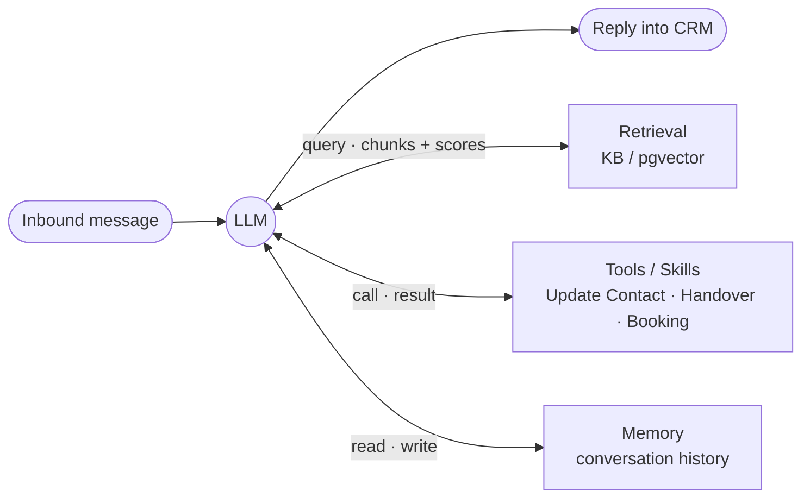

# Conversation AI Agent Harness

An agent harness that powers a [HighLevel](https://www.gohighlevel.com/) Conversation AI agent
end-to-end: it receives an inbound customer message, decides what to do — **answer from a knowledge
base, run a skill, or hand over to a human** — executes it, and replies back into the CRM
conversation, with a **full, inspectable trace** of every step.

Built for a fictional real-estate brokerage, **Demo Realty**. TypeScript · Fastify · Vercel AI SDK.

> **Demo Realty is a fictional business** invented for this take-home — not a real brokerage; its
> neighborhoods, prices, and policies are made up. “HighLevel” is a trademark of its respective owner;
> this project is independent and not affiliated with or endorsed by HighLevel.

---

## 👋 For the reviewer — start here

**It's live.** No setup needed to see it running:

| | URL |
|---|---|
| 🌐 **Demo site (with the live chat widget)** | **https://conversation-ai-harness.fly.dev/** |
| 🟢 Harness (health) | **https://conversation-ai-harness.fly.dev/health** |
| 🔎 Langfuse (self-hosted traces) | **https://conversation-ai-langfuse.fly.dev** |
| 💬 Real end-user path | the widget on the demo site → HighLevel workflow → this harness → reply (demo video) |

The **demo site** (Demo Realty) is served at `/` by the harness itself and embeds the HighLevel Live
Chat widget in the corner — chat there and the message flows through the full loop below.

Deployed on Fly.io (region `sin`): the harness on one always-warm machine, **Postgres** for durable
webhook idempotency, and a **self-hosted Langfuse v2** for traces. The live `/webhook` is
secret-protected (`x-webhook-secret`) as a production posture — exercise the full loop either via the
**HighLevel Live Chat widget** (the genuine user path, in the demo video) or **locally against mocks**
(next section), which needs no accounts.

### Evaluate the whole thing in ~10 minutes

```bash
pnpm install
echo "LLM_PROVIDER=claude
ANTHROPIC_API_KEY=sk-ant-...   # or set openai/gemini
EMBED_LOCAL=true               # on-device embeddings, no key
CRM_MODE=mock" > .env

pnpm ingest        # build the KB vector index (on-device embeddings)
pnpm test          # 143 unit tests
pnpm dev           # webhook server on :3000

# In another shell — send a customer message through the full loop (mock CRM):
curl -sX POST localhost:3000/webhook -H 'content-type: application/json' \
  -d '{"messageId":"m1","conversationId":"c1","contactId":"ct1","body":"What is your commission?","messageType":"SMS"}'

pnpm trace latest  # ← the answer to "why did the agent say that?"
pnpm eval          # one-command eval suite (add provider keys)
```

### Where each assignment requirement lives

| Requirement | Implementation | Verify it |
|---|---|---|
| **Multi-provider (Claude/OpenAI/Gemini), config-switchable** | `src/providers/` — one `AiSdkProvider` behind an `LLMProvider` seam | flip `LLM_PROVIDER`; `pnpm providers:smoke`; eval runs per-provider |
| **RAG *triggered selectively*, grounded, never invents** | retrieval is a **tool the agent chooses** (`src/rag/search-kb.tool.ts`); similarity threshold → explicit `grounded:false` → decline | `rag-trigger` + `groundedness` eval suites; a trace shows chunks+scores or *no* retrieval step |
| **Extensible skills = registration** | `src/skills/` — Update Contact, Human Handover, Appointment Booking; add one = one file + one array entry | `src/skills/index.ts`; the three `*.skill.ts` files |
| **Execution transparency (per-turn trace)** | canonical `Trace` → Langfuse + JSON + CLI (`src/trace/`) | `pnpm trace latest`, or the live Langfuse UI |
| **Webhook realities: idempotency + rapid messages** | `IdempotencyStore` (dedupe, w/ Postgres lease) + per-conversation `KeyedQueue` (serialize) | `src/orchestrator/{idempotency,queue}.ts` + tests |
| **Latency p50 ≤ 3s / p95 ≤ 6s** | fast-ack webhook, async processing; measured live at ~2.5s | `latency` eval suite; deployed turn logged `latencyMs: 2534` |
| **One-command evals w/ negatives** | `pnpm eval` — 116 gold cases across 5 behaviors + latency, incl. must-NOT-fire negatives | `pnpm eval`; `evals/` |
| **Team-of-One, functional-vs-mocked** | below + [`docs/`](./docs) | this README |

> 📐 [`docs/ARCHITECTURE.md`](./docs/ARCHITECTURE.md) · 🔌 [`docs/SETUP.md`](./docs/SETUP.md) (sandbox +
> Fly deploy) · 🎬 [`docs/DEMO.md`](./docs/DEMO.md) · 🛡️ [`docs/PRODUCTION_HARDENING.md`](./docs/PRODUCTION_HARDENING.md) ·
> 📄 [`docs/ASSIGNMENT.md`](./docs/ASSIGNMENT.md)

---

## The orchestration loop

One bounded tool-use loop is the single decision mechanism — no brittle intent classifier.

```
Inbound webhook → verify secret → normalize → idempotency dedupe → per-conversation queue → ack fast
                                                              │
                              ┌────────────────────────────────┘
                              ▼  Orchestrator.runTurn  (bounded tool-use loop)
       bot disabled? ──yes──▶ stay silent (already handed to a human)
            │no
            ▼
       system prompt + history (last 40 msgs) + user msg ──▶ provider.generate(tools)
            ├─ no tool call   → reply directly (chit-chat)      ← RAG NOT triggered
            ├─ search_kb      → retrieve (threshold) → grounded answer / decline
            ├─ a skill        → execute, feed result back, loop
            └─ handover       → stop bot, tag/reassign, send final message
            ▼
       send reply into CRM ──▶ emit Trace (Langfuse / JSON / CLI)
```

Why a tool-loop: the model's own tool-choice *is* the routing decision, so "when to retrieve",
"which skill", and "just chat" are one uniform mechanism — and each choice is visible in the trace.

### Architecture pattern — an *Augmented LLM* in a bounded agentic loop

The **Augmented LLM** — one model augmented with **retrieval, tools, and memory** — realized here
(adapted from Anthropic's [*Building Effective Agents*](https://www.anthropic.com/engineering/building-effective-agents)):



Mapped to that article, this harness is the **Augmented LLM** building block (*"an LLM enhanced with
retrieval, tools, and memory"*) run as a **bounded autonomous agent** (*"LLMs using tools based on
environmental feedback in a loop"*). **Routing** — RAG vs. a skill vs. plain chat — isn't a separate classifier; it
**emerges from the model's tool choice** inside that single loop. We deliberately follow the article's
*"simplicity first"* guidance and **avoid** the heavier workflow patterns (orchestrator-workers,
evaluator-optimizer, parallelization) — a single augmented LLM with a RAG tool, skills, and
conversation memory fully covers a CRM conversation agent. Skills are the article's **Agent-Computer
Interface**: each is a Zod-typed, documented tool the model fills but never authors.

**You can see the pattern in Langfuse:** every turn's trace tree *is* the loop —
`GENERATION` (decide) → `retrieval` / `tool:*` span (act on the environment) → `GENERATION` (answer) —
and the turn's `decision` name + `ragUsed` / `sources` / `toolsUsed` make the routing explicit.

---

## The four capabilities

**1. Multi-provider LLM.** One `AiSdkProvider` implements `LLMProvider` for all three vendors over
the Vercel AI SDK — same code, a different model handle. Errors normalize to typed classes
(`RateLimitError`, `AuthError`, `ContextLengthError`, `TransientError`) so retry/backoff is uniform.
An OpenAI-compatible `baseURL` lets the same seam drive gateways (Groq/OpenRouter). Adding a 4th
provider = one case in `src/providers/registry.ts`. **Switch = `LLM_PROVIDER` env.**

**2. RAG, triggered — not always-on.** Retrieval is a tool the agent calls only when it needs facts,
so chit-chat and skill turns never touch the vector store (the assignment's core RAG concern). A
heading-aware chunker → on-device embeddings (`bge-small`, 384-dim) → cosine search. A similarity
**threshold** produces an explicit `grounded:false` signal, so the agent **declines rather than
invents** when the KB has no answer. 14 KB docs → 94 chunks.

**3. Extensible skills.** Each skill is an `AgentTool` (name + Zod schema + `run`), and the schema is
surfaced to the model and validated on the way in. Adding one is **registration** — a file plus an
entry in `src/skills/index.ts`:
- **Update Contact Field** — extracts name/email/budget/preferred-time the customer shares and writes
  them to the contact (standard vs. custom fields mapped for HighLevel).
- **Human Handover** — on explicit ask / frustration / out-of-scope: sends a final message, stops the
  bot, tags + reassigns the contact. Bot-off state is **durable** (rehydrates from the CRM tag).
- **Appointment Booking** — `get_available_slots` (handles "tomorrow afternoon") + `book_appointment`;
  handles **no-availability** and **slot-taken races**, and is **idempotent** (won't double-book).

**4. Execution transparency.** Every turn emits a canonical `Trace`: assembled system prompt,
provider/model, whether RAG fired (chunks + scores), each tool's inputs/outputs/CRM calls, tokens,
and per-step latency. Fanned out to **self-hosted Langfuse**, **JSON files**, and a **CLI viewer**
(`pnpm trace`). PII (emails/phones) is masked at these sinks; the LLM input keeps the real values.

---

## Latency & Evals (the quality bars)

**Latency** — fast webhook ack + async per-conversation processing. Target **p50 ≤ 3s / p95 ≤ 6s**
webhook-to-send for non-RAG turns; a deployed knowledge turn measured **2.5s** end-to-end.

**Evals — one command, negatives included, per provider:**

```bash
pnpm eval                          # all providers with a key, all suites
pnpm eval openai handover latency  # provider(s) + suite filter
```

Runs real turns and scores each trace against **116 gold-labeled cases** across five behaviors, plus
a latency suite:

| Suite | Cases | Measures |
|---|---|---|
| `rag-trigger` | 26 | precision/recall of *deciding to retrieve* (chit-chat/skill turns must not) |
| `groundedness` | 24 | grounded answers contain expected facts; out-of-KB questions are declined |
| `update-contact` | 22 | extraction fires + correct fields; **negatives don't fire** |
| `handover` | 22 | fires on explicit/frustrated/out-of-scope; **negatives don't fire** |
| `appointment` | 22 | booking intent triggers slot lookup; **negatives don't fire** |
| `latency` | 8 | p50/p95 webhook-to-send (non-RAG) |

Grounded facts are matched with word/number boundaries (so `5%` ≠ `15%`); declines are checked
against a fabricated-figure denylist. Infra errors (e.g. a missing embedding key) are surfaced as
errors — they never masquerade as model behavior. Record results in
[`docs/EVAL_RESULTS.md`](./docs/EVAL_RESULTS.md).

---

## Architecture & key decisions

The **seams are the design** — provider / skill / CRM / tracing are independent interfaces, so the
graders' "is a 4th provider or 3rd skill cheap?" question is a clear yes.

| Decision | Why | Trade-off |
|---|---|---|
| **Bounded tool-use loop** as the only router | model tool-choice = routing; uniform + fully traceable | trusts the model to choose tools (bounded by `maxSteps`) |
| **RAG as a tool**, threshold-gated | selective retrieval + explicit decline (never invent) | one extra model hop when it does retrieve |
| **On-device embeddings** (`bge-small`) | zero embedding-API cost/latency; runs offline | model download baked into the image |
| **Flat in-memory vector index** (file), pgvector opt-in | sub-ms over ~94 chunks, zero infra | pgvector (`PGVECTOR=true`) for scale/live-reingest |
| **HighLevel is system-of-record** | contacts + conversations aren't duplicated into our DB | history re-hydration from HL is a documented next step |
| **Mock-first CRM** behind `CrmClient` | whole loop runs offline; live client is a config swap | live HL client shapes unit-tested, then exercised live |

More in [`docs/ARCHITECTURE.md`](./docs/ARCHITECTURE.md).

---

## Production hardening (beyond the core spec)

All behind the existing seams; the DB-less/no-Langfuse default still runs unchanged. Deployed live.

- **Webhook authenticity** — `/webhook` requires a shared secret (`x-webhook-secret` /
  `Authorization: Bearer`), constant-time compared; open only when unset (dev).
- **Persistence** — webhook idempotency (`processed_messages`) → **Postgres** when `DATABASE_URL` is
  set; the KB is opt-in pgvector (`PGVECTOR=true`, needs the `vector` extension). HighLevel stays
  system-of-record. All env-selected — no code change.
- **Crash-safe, exactly-once** — idempotency uses a `processing → done` **lease** so a crash mid-turn
  is reclaimed, not dropped; `book_appointment` is idempotent so a retry can't double-book.
- **Durable handover** — bot-off rehydrates from the CRM `bot-handover` tag, surviving restarts.
- **PII masking** at logs + trace exports (pino `redact.paths` + a free-text email/phone hook).
- **Deploy** — `Dockerfile` + `fly.toml` (warm machine, health check, baked KB + embed model);
  self-hosted **Langfuse v2** in `deploy/langfuse/`.

Full plan + rationale + what's deferred for the POC (managed PG, horizontal scaling, timeouts/
failover, metrics/SLO, hybrid-search/rerank, CI eval gate): [`docs/PRODUCTION_HARDENING.md`](./docs/PRODUCTION_HARDENING.md).

---

## Quickstart (local, against mocks — no accounts)

Prereqs: **Node ≥ 20**, **pnpm** (built on Node 22 + pnpm 10.29.3).

```bash
pnpm install
cp .env.example .env     # minimum below
pnpm ingest              # build the KB index (on-device embeddings)
pnpm dev                 # webhook on :3000
```

Minimum `.env`:
```
LLM_PROVIDER=claude
ANTHROPIC_API_KEY=sk-ant-...     # key for whichever LLM_PROVIDER you pick
EMBED_LOCAL=true                  # on-device embeddings — no embedding key
CRM_MODE=mock                     # in-memory CRM — no HighLevel account
```
`EMBED_LOCAL=true` runs Transformers.js on-device (model downloads once, ~130 MB). Set `false` to use
a cloud embedder (`EMBED_PROVIDER`/`EMBED_MODEL`). For the real sandbox + Fly deploy, see
[`docs/SETUP.md`](./docs/SETUP.md).

## Commands

| Command | What it does |
|---|---|
| `pnpm dev` | Run the webhook server (hot reload) |
| `pnpm ingest` | Chunk + embed `kb/*.md` → `data/index/kb.json` |
| `pnpm eval [provider...] [suite...]` | One-command eval suite |
| `pnpm trace [<id>\|latest]` | Terminal trace viewer |
| `pnpm providers:smoke [provider]` | Check a provider returns a tool call |
| `pnpm test` · `pnpm typecheck` · `pnpm lint` | 143 tests · types · lint |
| `pnpm db:migrate` · `pnpm ingest:pg` | Apply schema / load KB into Postgres (when `DATABASE_URL` set) |

## Repo layout

```
src/
  config/        env schema (zod), pg pool, migrate
  server/        Fastify app: /webhook (+auth), /health, OAuth routes
  orchestrator/  turn loop, idempotency (mem/pg), per-convo queue, history, tool dispatch
  providers/     LLMProvider over the Vercel AI SDK + registry
  llm/           canonical types, typed errors, retry
  rag/           chunker, embedder, vector index (file/pg), retriever, ingest, search_kb tool
  skills/        registry + update-contact / handover / appointment
  crm/           CrmClient interface + MockCrmClient + highlevel/ (real client, OAuth/PIT)
  trace/         Trace types, collector, exporters (Langfuse / JSON / console), CLI
  util/          logger (PII-redacting), redact
evals/           harness, runners, scoring, cases/*.json, report
kb/              14 markdown docs (Demo Realty)
db/              schema.sql (core) + schema-pgvector.sql (opt-in)
deploy/langfuse/ self-hosted Langfuse v2 Fly config
docs/            ARCHITECTURE, SETUP, DEMO, PRODUCTION_HARDENING, EVAL_RESULTS, ASSIGNMENT
```

## Team-of-One ownership

- **Product** — scoped to the four capabilities and a coherent persona (a boutique brokerage) so
  every skill and KB doc reinforces one story; the business was chosen to fit the required contact
  fields (budget, preferred time) and appointment booking.
- **Design** — the seams *are* the design (provider/skill/CRM/tracing as independent interfaces); the
  trace surface is designed around one question: *why did the agent say that?*
- **Engineering** — a bounded tool-use loop as the single decision mechanism; the Vercel AI SDK for
  normalized multi-provider calls; a swappable vector index (file → pgvector); mock-first, offline-runnable.
- **QA** — 143 unit tests + an independent adversarial review sweep after every phase (findings
  applied before moving on), plus the eval suite as behavioral regression coverage.

## Functional vs. mocked

**Functional (tested + running live):** the full orchestration loop, all three provider adapters,
RAG ingest + retrieval + threshold, all three skills **exercised against the real HighLevel sandbox**
(contact updates, handover tag, a real appointment booked), tracing, the eval harness, webhook
auth + Postgres idempotency + PII masking — all deployed on Fly.

**Requires keys to exercise:** live LLM/embedding calls (API keys) and the Langfuse dashboard (a
Langfuse instance — one is deployed). **Deferred for the POC** (documented, not built): managed
Postgres, horizontal scaling, request timeouts/failover, metrics/SLO alerting, hybrid-search/rerank,
CI eval gate — see [`docs/PRODUCTION_HARDENING.md`](./docs/PRODUCTION_HARDENING.md).
